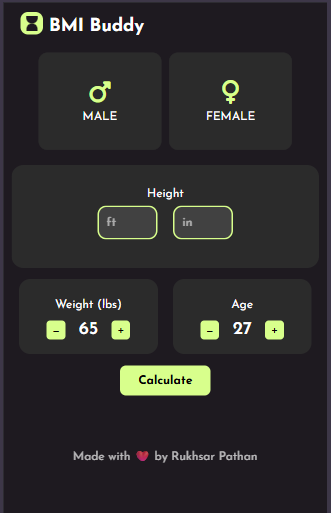
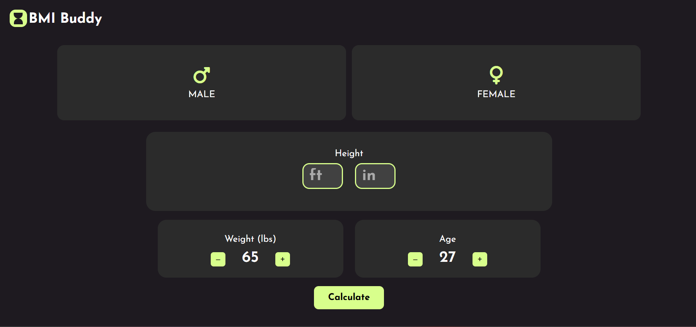

# BMI Buddy 💚💪
🔗 Live Site: [BMI Buddy Web App](https://rukhsarpathan.github.io/BMIBuddy/)

## 🧠 What is BMI Buddy?
BMI Buddy is a modern, responsive, and easy-to-use Body Mass Index (BMI) calculator designed to give users a quick overview of their health status. It provides insights based on gender, height, weight, and age — and gives visual recommendations tailored to their BMI category.

## ✨ Features
	• 👥 Gender selection (Male or Female)
	• 📏 Height input (in feet and inches)
	• ⚖️ Weight and Age control using interactive buttons
	• 🧮 Instant BMI Calculation on click
	• 📊 BMI Category Insights: Underweight, Normal, Overweight, or Obese
	• ✅ Smart health tips based on the result

##💡 Why It’s Useful
With lifestyle changes and remote working becoming the norm, many individuals overlook regular health checkups. BMI Buddy is a quick and effective way to check your BMI and get recommendations that help you stay informed and proactive about your health — without needing to Google formulas or browse cluttered websites.

## 🎨 Design & Tech
BMI Buddy is thoughtfully designed to look fresh, user-friendly, and visually engaging. Here's what powers it:
### 💻 Tech Stack
	• HTML for structure
	• CSS (with custom properties / variables) for styling
	• JavaScript for interactivity and logic
### 🧑‍🎨 UI Highlights
	• Glassmorphism-inspired block UI
	• Custom color palette featuring soft greens and muted dark backgrounds
	• Font: Josefin Sans for a modern and clean typeface
	• Beautiful range slider and animated button interactions

### 📱 Responsiveness
	• Designed mobile-first 📱
	• Fully responsive for tablet and desktop 🖥️
	• Elements resize elegantly across breakpoints

### ⚙️ Core Elements Used
	• Flexbox for layout management
	• CSS Variables for color theming
	• JavaScript functions and DOM manipulation for calculations
	• Event listeners for buttons and inputs
	• Media queries for responsive behavior

 ## Design Inspirtation
 ### Dribbble
 Credits: [Urvik Moradiya](https://dribbble.com/shots/22451667-BMI-Calculator-Mobile-App-UI-Design)

## 👩🏻‍💻 Made With Love
Made with ❤️ by Rukhsar Pathan

### 🔗 Connect on LinkedIn: [Rukhsar Pathan](https://www.linkedin.com/in/rukhsarpathan7/)

### 📸 Screenshots

#### 📱 Mobile View  

#### 💻 Desktop View  

